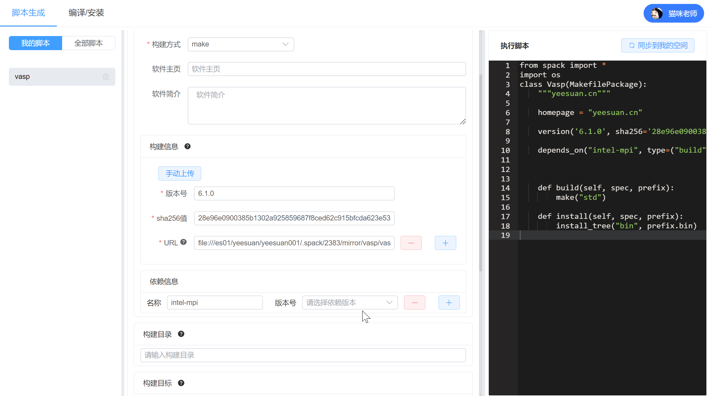

 

     <h1>樊悦强</h1>
     

         
             
             19107499679
         
         ·
         
             
             fanyq.mr@gmail.com
         
         ·
         
             
             <a href="https://github.com/bitllion">bitllion</a>
         
         ·
         
             
             <a href="https://blog.bitllion.top">bitllion的hpc小站</a>
         
     

 

 ##  个人信息 

 - 男，1998 年出生
 - 求职意向：Python&Linux运维开发工程师
 - 工作经验：1 年

##  教育经历

- 学士，潍坊学院，计算机科学与技术专业（软件外包），2017.9~2021.7
- 通过了 CET4 英语等级考试

##  工作经历

- **济南超算下属子公司，并行 部门，linux 运维工程师，2021.7~2021.7**

    1.服务器上架、网络布线、交换机配置、划分网络
    2.使用开源promox（KVM虚拟化内核）搭建去中心化的虚拟化集群
    3.上层安装N个虚拟机，k8s集群管理，负载均衡nginx ingress，再部署各种应用
    4.应用主要为开发基础环境：mysql、redis、nginx、tomcat、php、nodejs、python、ruby、go，数据库主从备份
    
- **开源科学计算软件包管理器spack的web可视化接口,2021.8~至今**
  
  技术栈：`python fastapi + mysql + redis`
  
  前端填写编译软件的基本参数，后台生成一个通用型的python安装脚本

  
  
- ★★☆ Python 、Linux Shell
- ★★☆ MySQL 、 Redis 、Git
